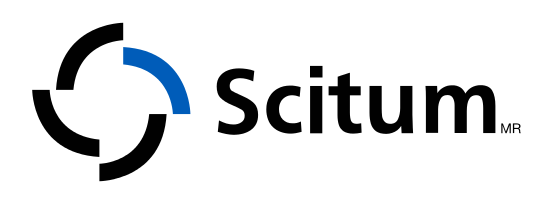
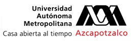
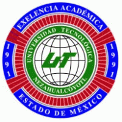
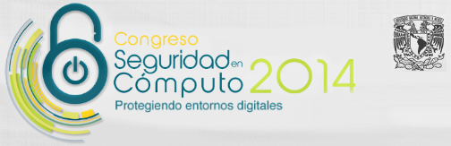
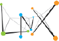
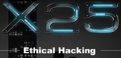

---

layout: col-sidebar
title: OWASP Mexico City
tags: example-tag
level: 0

region: Latin America

auto-migrated: 1

---

<h1>Bienvenidos</h1>
<hr>
<br>
<h2>OWASP Ciudad de México</h2>
<hr>
<br>
Bienvenido a la página principal del capítulo de la Ciudad de México. El líder del capítulo es <a rel="nofollow" class="external text" href="mailto:carlos.sagrero@owasp.org">Carlos Isaac Sagrero Campos</a>. <a href="https://groups.google.com/a/owasp.org/forum/#!forum/mexico-city-chapter"><b>De clic aquí</b></a> para unirse a la lista de distribución del capítulo.
<br><br>
<h2>Participación</h2>
<hr>
<br>
La Fundación OWASP <a rel="nofollow" class="external text" href="https://docs.google.com/a/owasp.org/presentation/d/1ZgY25F0F7QgScMlB1X7LAa70LtyJql8XqcYdR4suPUo/edit#slide=id.p">(Presentación)</a> es una asociación profesional conformada por miembros internacionales, libre y abierta a todo aquel que desee aprender más sobre la seguridad en el software. Los capítulos locales son administrados de manera independiente tomando como guía el Manual del Líder de Capítulo (<a rel="nofollow" class="external text" href="https://www.owasp.org/index.php/Chapter_Leader_Handbook">Chapter_Leader_Handbook</a>). Conforme a su categoría <a rel="nofollow" class="external text" href="https://www.owasp.org/index.php/About_OWASP">501(c)(3)</a> como asociación profesional sin fines de lucro, tu apoyo y patrocinio para proporcionar instalaciones o bebidas pueden ser deducibles de impuestos. Las contribuciones financieras únicamente deben de ser realizadas en línea, por medio del botón autorizado de donación para el capítulo. Para participar como Ponente en CUALQUIER CAPITULO DE OWASP en cualquier parte del mundo, es necesario revisar el <a rel="nofollow" class="external text" href="https://www.owasp.org/index.php/Speaker_Agreement">acuerdo de ponente</a> y contactar al líder del capítulo local con los detalles del tema que se desea exponer, ya sea un PROYECTO DE OWASP, una investigación independiente o cualquier tema relacionado con la seguridad del software.
<br>
<br>
<h2>Patrocinadores del Capítulo</h2>
<hr>
<br>
<p>Agradecemos todo el apoyo brindado al capítulo OWASP Ciudad de México a:</p>
<br>
<center></center>
<br>
<p><b>Agradecimientos especiales</b></p>
<table>
  <trbody>
    <tr>
      <td><center></center></td>
      <td><center></center></td>
      <td><center></center></td>
    </tr>
    <tr>
      <td><center></center></td>
      <td><center></center></td>
      <td><center></center></td>
    </tr>
  </trbody>
</table>
<p>Por todas las facilidades brindadas para la realización de eventos.</p>
<br>

<h2>Social</h2>
  <hr>
  <br>

A continuación ponemos a su disposición nuestras redes sociales donde podrán estar informados acerca de las actividades de **OWASP Ciudad de México**:
<br>
<a href="http://www.twitter.com/OWASP_MX_City" rel="nofollow">
<br>
<br>
<h2>Soporte y donaciones</h2>
<hr>
<br>
Si deseas colaborar en los esfuerzos del capítulo OWASP Ciudad de México, puedes hacerlo de las siguientes maneras:<br>
<ul>
  <li>Formando parte de nuestra lista de distribución.</li>
  <li>Participando en nuestros eventos y promoviendo el capítulo.</li>
  <li>Contribuyendo en la generación de contenido para eventos.</li>
  <li>Como Patrocinador.</li>
  <li>Como Expositor.</li>
  <li>Realizando donaciones.</li>
</ul>
<br>

<!-- Standard Chapter Page Template
This is an example of a Project or Chapter page.
Please change these items to indicate the actual information you wish to present. In addition to this information, the 'front-matter' above the text should be modified to reflect your actual information.  An explanation of each of the front-matter items is below:

{front matter for this file}

```
- layout: This is the layout used by project and chapter pages.  You should leave this value as col-sidebar
- title: This is the title of your project or chapter page, usually the name.  For example, OWASP Zed Attack Proxy or OWASP Baltimore
- tags: This is a space-delimited list of tags you associate with your project or chapter.  If you are using tabs, at least one of these tags should be unique in order to be used in the tabs files (an example tab is included in this repo) 
- region: This is the region you are in according to our data
```

{copy for this file (index.md)}
Replace the text above the commented area with your information in the format below:
```
## Welcome
Include some information here about your chapter

## Participation
The Open Web Application Security Project (OWASP) is a nonprofit foundation that works to improve the security of software. All of our projects ,tools, documents, forums, and chapters are free and open to anyone interested in improving application security. 

Chapters are led by local leaders in accordance with the [Chapter Leader Handbook](/www-policy/rules-of-procedure/chapter-handbook). Financial contributions should only be made online using the authorized online donation button. To be a SPEAKER at ANY OWASP Chapter in the world simply review the [speaker agreement](/www-policy/speaker-agreement) and then contact the local chapter leader with details of what OWASP Project, independent research, or related software security topic you would like to present.

Everyone is welcome and encouraged to participate in our [Projects](/projects), [Local Chapters](/chapters), [Events](/events), [Online Groups](https://groups.google.com/a/owasp.com/){:target='_blank'}, and [Community Slack Channel](https://owasp.slack.com/){:target='_blank'}. We especially encourage diversity in all our initiatives. OWASP is a fantastic place to learn about application security, to network, and even to build your reputation as an expert. We also encourage you to be [become a member](/membership) or consider a [donation](/donate) to support our ongoing work.

## Local News
- Meeting Location
- Everyone is welcome to join us at our chapter meetings.

```
{info.md}

This separate file is where you should place links to your Google Group and Meetup page. It will be automatically rendered in the column sidebar.

{leaders.md}

Another separate file that should simply include each leaders name with mailto link as a list. It will also be automatically rendered in the column sidebar.

-->
