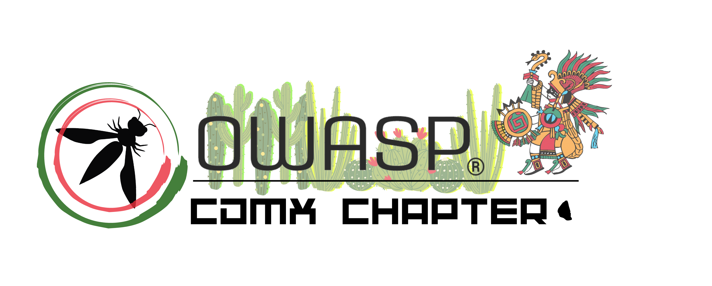
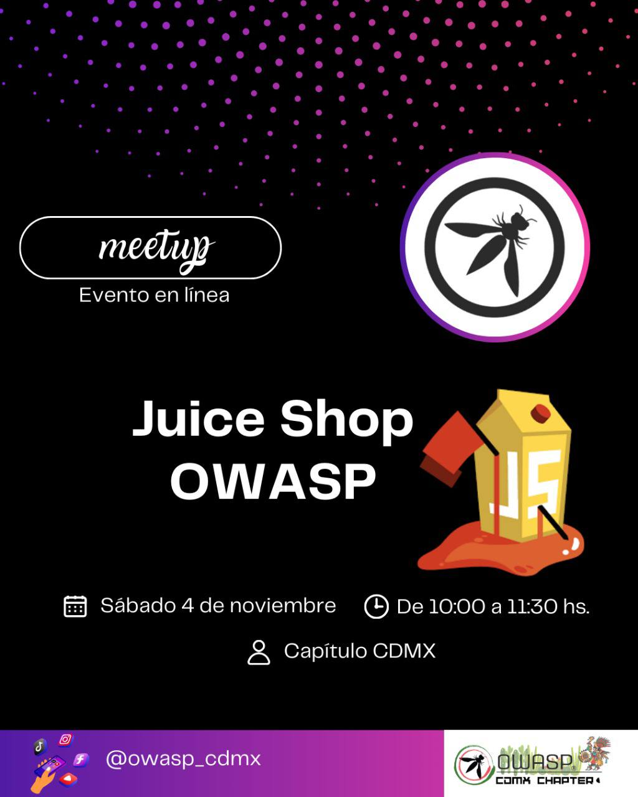
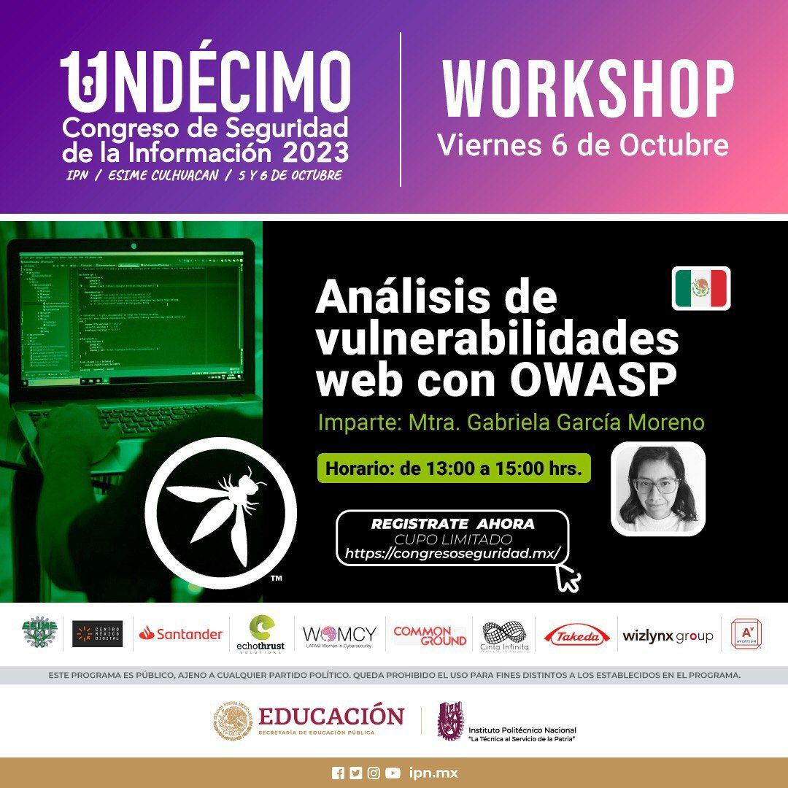

---

layout: col-sidebar
title: OWASP Mexico City
tags: 
region: North America
country: Mexico
meetup-group: owasp-mexico-city-chapter

---

  
## ¡Bienvenido!

OWASP Capítulo Ciudad de México, dentro de sus objetivos, busca unificar y enfocar los esfuerzos de distintas disciplinas para lograr la divulgación, la conscienciación y la investigación en el ámbito de la Seguridad de la Información y cyberseguridad, así como todas aquellas actividades relacionadas a éstas, mediante la realización de conferencias, charlas, talleres y actividades de investigación y desarrollo.

## Participation
OWASP es una fundación sin fines de lucro, que tiene como finalidad mejorar la seguridad del software. Todos los proyectos, herramientas, documentos, foros y capítulos son gratuitos y abiertos a cualquier persona interesada en fortalecer la seguridad de aplicaciones. 

Los Capítulos son dirigidos por los líderes locales de acuerdo con la [Política de los Capítulos/Chapters Policy](/www-policy/operational/chapters). Las contribuciones financieras deberán sólo ser hechas por los canales autorizados mediante pagos en línea. 

Todos son bienvenidos e incentivados para participar en nuestros [Proyectos](/projects/), [Local Chapters](/chapters/), [Eventos](/events/), [Online Groups](https://groups.google.com/a/owasp.com/), y [Community Slack Channel](https://owasp.slack.com/). Ponemos énfasis en la diversidad en todas nuestras iniciativas. OWASP es un lugar fantástico para aprender entorno a la seguridad en aplicaciones, para la red e incluso para construir tu propia reputación como experto. Adicionalmente te invitamos a formar parte como [miembro](/membership/) o realizar [donativos](/donate/) y apoyar nuestro trabajo. 

Next Meeting/Event <!-- You should keep this section as it will populate your meetup events -->
---------------------
## 2023 CDMX CHAPTER UPCOMING EVENTS : 

Keep connected!

## 2023 CDMX CHAPTER LAST EVENTS:

## Chapter meetings:
El pasado sábado 4 de noviembre celebramos nuestro primer CHAPTER MEETING. <a href="assets/Chapter meeting -  JuiceShop -OWASP_CDMX.pdf">  Slides del workshop </a>

## Workshops:
El 6 de octubre, se impartió el Workshop "Análisis de vulnerabilidades web con OWASP" en el Congreso de Seguridad de la Información IPN 2023 <a href="assets/AVOWASP-CSI23.pdf">  Slides del workshop </a>
  


---

## OTHER UPCOMING EVENTS AROUND THE GLOBE:
2023 Global AppSec Washington, DC October 30 - November 3, 2023 https://dc.globalappsec.org/

OWASP BeNeLux Days November 23-24, 2023 https://www.owaspbenelux.eu/
