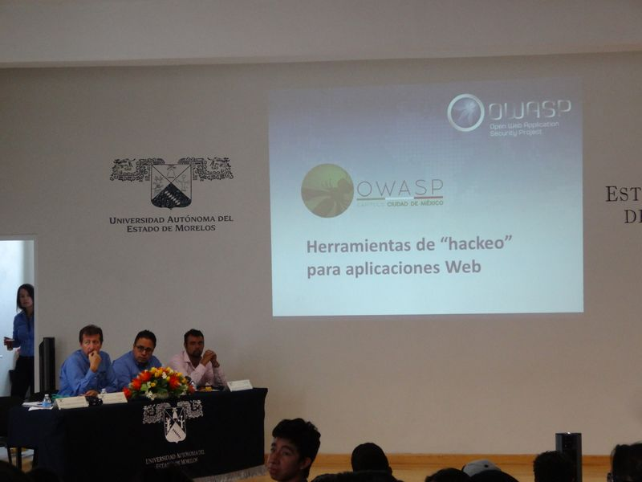
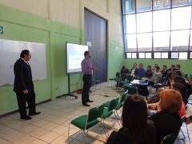
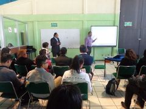
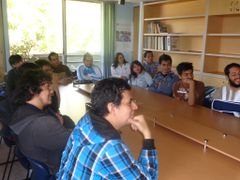

## Eventos 

## Eventos pasados
 

<h3>Mayo 2019</h3>

 
<table>
  <tbody>
    <tr>
      <td colspan="2">

</td>
    </tr>
    <tr>
      <td><b>Evento</b> </td>
      <td> OWASP LatamTour 2019 (Cozumel).</td>
    </tr>
    <tr>
      <td><b>Lugar</b> </td>
      <td>  Centro de Convenciones de Cozumel, en Isla de Cozumel, Quintana Roo, Mexico.</td>
    </tr>
    <tr>
      <td><b>Sitio Web</b> </td>
      <td> <a rel="nofollow" class="external free" href="https://www.owasp.org/index.php/Riviera_Maya#OWASP_Latam_Tour_2019">https://www.owasp.org/index.php/Riviera_Maya#OWASP_Latam_Tour_2019</a></td>
    </tr>
    <tr>
      <td><b>Registro</b></td>
      <td> La entrada a las conferencias es gratuita con previo registro. <a rel="nofollow" class="external text" href="https://www.eventbrite.com/e/owasp-latam-tour-2019-mexico-tickets-55739358923">REGISTRATE AQUÍ</a></td>
    </tr>
  </tbody>
</table>

Hola comunidad de OWASP Capítulo Ciudad de México, les informamos que ya se ha iniciado la publicación de parte de la agenda para <b>OWASP LATAM TOUR 2019 México</b>, visten la siguiente liga para más información <a rel="nofollow" class="external text" href="https://www.owasp.org/index.php/LatamTour2019#tab=M_C3_89XICO">LatamTour2019 - México</a>

Les hacemos una cordial invitación al OWASP LatamTour 2019 - Cozumel, para más información por favor sigan la siguiente cuenta de twitter:
<a rel="nofollow" class="external text" href="https://twitter.com/owasp_riviera?lang=es">OWASP Rivera Maya</a>
 
 

<h3>Marzo 2019</h3>

 
<table>
  <tbody>
    <tr>
      <td colspan="2">

</td>
    </tr>
    <tr>
      <td><b>Evento</b> </td>
      <td> Jornada de Seguridad Informática.</td>
    </tr>
    <tr>
      <td><b>Lugar</b> </td>
      <td>  Auditorio de la UTN y Laboratorios de Informática, Universidad Tecnológica de Nezahualcóyotl - División de Informática y Computación.</td>
    </tr>
    <tr>
      <td WIDTH="150"><b>Talleres</b></td>
      <td>
        <table>
          <tbody>
            <tr>
              <td><i>Más allá de un ' or 1=1</i></td>
              <td><b>Christian Alberto Cruz Nicolás</b></td>
            </tr>
            <tr>
              <td><i>Mi inofensivo Cross-Site Scripting</i></td>
              <td><b>Héctor Manuel Rojas Pérez</b></td>
            </tr>
          </tbody>
        </table>
      </td>
    </tr>
    <tr>
      <td><b>Conferencias</b></td>
      <td>
        <table>
          <tbody>
            <tr>
              <td><i>Ser un Web Application Penetration Tester Mitos y realidades</i></td>
              <td><b>Antonio Rivera Crespo</b></td>
            </tr>
            <tr>
              <td><i>Utilizando Reflection para volver una aplicación Java Zombi</i></td>
              <td><b>Carlos Isaac Sagrero Campos</b></td>
            </tr>
            <tr>
              <td><i>Retos de la ingeniería inversa en seguridad</i></td>
              <td><b>Edgar Uch Flores</b></td>
            </tr>
          </tbody>
        </table>
      </td>
    </tr>
    <tr>
      <td><b>Sitio Web</b></td>
      <td><a rel="nofollow" class="external text" href="http://www.utn.edu.mx/slider/file/jornada_seguridad.pdf">Agenda de actividades</a></td>
    </tr>
  </tbody>
</table>
 

<h3>Julio 2018</h3>

 
<table>
  <tbody>
    <tr>
      <td><b>Lugar</b></td>
      <td>Universidad Autonoma del Estado de Morelos.</td>
    </tr>
    <tr>
      <td><b>Título</b></td>
      <td>Herramientas de "hackeo" para aplicaciones Web.</td>
    </tr>
    <tr>
      <td><b>Ponente</b></td>
      <td>Carlos Isaac Sagrero Campos.</td>
    </tr>
  </tbody>
</table>
 
<table>
  <tbody>
    <tr>
      <td>

</td>
      <td>

</td>
      <td>

</td>
    </tr>
    <tr>
      <td>

</td>
      <td>

</td>
      <td>

</td>
    </tr>
    <tr>
      <td>

</td>
      <td>

</td>
      <td>

</td>
    </tr>
    <tr>
      <td>

</td>
      <td>

</td>
      <td>

</td>
    </tr>
    <tr>
      <td>

</td>
      <td colspan="2">

</td>
    </tr>
  </tbody>
</table>
 

<h3>Marzo 2018</h3>

 
<table>
  <tbody>
    <tr>
      <td WIDTH="150"><b>Evento</b></td>
      <td>OWASP LatamTour 2018 Rivera Maya - CONFERENCIAS.</td>
    </tr>
    <tr>
      <td><b>Fecha</b></td>
      <td>20 y 21 de abril de 2018.</td>
    </tr>
    <tr>
      <td><b>Lugar</b></td>
      <td>Tech Garage, en Cancun, Quintana Roo, Mexico.</td>
    </tr>
    <tr>
      <td><b>Sitio Web</b></td>
      <td><a rel="nofollow" class="external text" href="https://www.owasp.org/index.php/LatamTour2018#tab=Mexico">OWASP LatamTour 2018 Rivera Maya</a></td>
    </tr>
  </tbody>
</table>
 

<table>
  <tbody>
    <tr>
      <td WIDTH="150"><b>Evento</b></td>
      <td>Jornada Tecnológica de Informática y Sistemas - Instituto Tecnológico de Chilpancingo</td>
    </tr>
    <tr>
      <td><b>Ponencia</b></td>
      <td>Hacktivismo, anatomía de un ataque de Annonymous. 	Lic. Carlos Isaac Sagrero Campos.</td>
    </tr>
    <tr>
      <td><b>Taller</b></td>
      <td>Hackeando una Aplicación Web en Minutos. Ing. Hector Manuel Rojas Pérez e Ing. Bryan Díaz Esparza.</td>
    </tr>
    <tr>
      <td><b>Fecha</b></td>
      <td>23 de marzo de 2018.</td>
    </tr>
  </tbody>
</table>
 
<table>
  <tbody>
    <tr>
      <td>

</td>
      <td>

</td>
      <td>

</td>
    </tr>
    <tr>
      <td>

</td>
      <td>

</td>
      <td>

</td>
    </tr>
    <tr>
      <td>

</td>
      <td>

</td>
      <td>

</td>
    </tr>
  </tbody>
</table>
 

<h3>Noviembre 2016</h3>

 
<table>
  <tbody>
    <tr>
      <td><b>Fecha</b></td>
      <td>9 de noviembre de 2016. 11:00 hrs - 16:00 hrs.</td>
    </tr>
    <tr>
      <td><b>Lugar</b></td>
      <td>IPN ESIME Culhuacan, SEPI MISTI.</td>
    </tr>
    <tr>
      <td><b>Taller</b></td>
      <td>Wep Application Penetration Testing.</td>
    </tr>
    <tr>
      <td><b>Ponentes</b></td>
      <td>Carlos Isaac Sagrero Campos, Edgar Uch Flores.</td>
    </tr>
    <tr>
      <td><b>Sitio Web</b></td>
      <td>http://congresoseguridad.org/main.php</td>
    </tr>
  </tbody>
</table>
 
 

<table>
  <tbody>
    <tr>
      <td><b>Fecha</b></td>
      <td>10 de noviembre 2016.</td>
    </tr>
    <tr>
      <td><b>Lugar</b></td>
      <td>Universidad Nacional Autónoma de México, Torre de Ingeniería -- Aula D</td>
    </tr>
    <tr>
      <td><b>Taller</b></td>
      <td>OWASP Top 10 2013.</td>
    </tr>
    <tr>
      <td><b>Ponentes</b></td>
      <td>Carlos Isaac Sagrero Campos.</td>
    </tr>
    <tr>
      <td><b>Sitio Web</b></td>
      <td><a href="http://www.bugcon.org/index.html">http://www.bugcon.org/index.html</a></td>
    </tr>
  </tbody>
</table>
 
 

<table>
  <tbody>
    <tr>
      <td><b>Fecha</b></td>
      <td>10 de noviembre de 2016. 10:00 11:00 hrs.</td>
    </tr>
    <tr>
      <td><b>Lugar</b></td>
      <td>IPN ESIME Culhuacan.</td>
    </tr>
    <tr>
      <td><b>Taller</b></td>
      <td>Hunting.</td>
    </tr>
    <tr>
      <td><b>Ponentes</b></td>
      <td>Murena Myrope Lavin Martínez.</td>
    </tr>
    <tr>
      <td><b>Sitio Web</b></td>
      <td>http://congresoseguridad.org/main.php</td>
    </tr>
  </tbody>
</table>
 
 

<h3>Diciembre 2015</h3>

 
<table>
  <tbody>
    <tr>
      <td><b>Fecha</b></td>
      <td>02/Diciembre/2015.</td>
    </tr>
    <tr>
      <td><b>Lugar</b></td>
      <td>SoftwareGuru.</td>
    </tr>
    <tr>
      <td><b>Webinar</b></td>
      <td>Modelo de madurez de aseguramiento de software (Open SAMM).</td>
    </tr>
    <tr>
      <td><b>Ponente</b></td>
      <td>Mtro. Juan Pablo Carsi Reyna.</td>
    </tr>
  </tbody>
</table>
 
 

<h3>Octubre 2015</h3>

 
<table>
  <tbody>
    <tr>
      <td><b>Evento</b></td>
      <td>

</td>
    </tr>
    <tr>
      <td><b>Fecha</b></td>
      <td>22/Octubre/2015 - 23/Octubre/2015.</td>
    </tr>
    <tr>
      <td><b>Stand</b></td>
      <td>OWASP Capítulo Ciudad de México.</td>
    </tr>
    <tr>
      <td><b>Lugar</b></td>
      <td>Equipo OWASP Ciudad de México.</td>
    </tr>
  </tbody>
</table>
 
 

<table>
  <tbody>
    <tr>
      <td><b>Evento</b></td>
      <td>

</td>
    </tr>
    <tr>
      <td><b>Fecha</b></td>
      <td>22/Octubre/2015.</td>
    </tr>
    <tr>
      <td><b>Conferencia Magistral</b></td>
      <td>Modelo de Madurez de Aseguramiento de Software, ¿La solución para evitar que tus aplicaciones sean vulnerables?</td>
    </tr>
    <tr>
      <td><b>Ponente</b></td>
      <td>Mtro. Juan Pablo Carsi Reyna.</td>
    </tr>
    <tr>
      <td><b>Lugar</b></td>
      <td>Auditorio Principal, ESIME Culhuacan.</td>
    </tr>
  </tbody>
</table>
 
 

<table>
  <tbody>
    <tr>
      <td WIDTH="150"><b>Evento</b></td>
      <td>

</td>
    </tr>
    <tr>
      <td><b>Fecha</b></td>
      <td>22/Octubre/2015.</td>
    </tr>
    <tr>
      <td><b>Taller</b></td>
      <td>Herramientas de Hacking para aplicaciones Web, ¿Cómo son utilizadas por los atacantes?</td>
    </tr>
    <tr>
      <td><b>Ponente</b></td>
      <td>Carlos Isaac Sagrero Campos.</td>
    </tr>
    <tr>
      <td><b>Lugar</b></td>
      <td>ESIME Culhuacan.</td>
    </tr>
  </tbody>
</table>
 
 

<table>
  <tbody>
    <tr>
      <td><b>Fecha</b></td>
      <td>19/Octubre/2015.</td>
    </tr>
    <tr>
      <td><b>Conferencia</b></td>
      <td>OWASP Top 10 - Los 10 riesgos más críticos en Aplicaciones WEB.</td>
    </tr>
    <tr>
      <td><b>Ponentes</b></td>
      <td>Daniel Castrejón, Hector Manuel Rojas Pérez.</td>
    </tr>
    <tr>
      <td><b>Lugar</b></td>
      <td>PROSA, México DF.</td>
    </tr>
  </tbody>
</table>
 
 

<table>
  <tbody>
    <tr>
      <td><b>Fecha</b></td>
      <td>06/Octubre/2015.</td>
    </tr>
    <tr>
      <td><b>Lugar</b></td>
      <td>Colegio de Ciencias y Humanidades Plantel Sur (CCH Sur), México DF.</td>
    </tr>
    <tr>
      <td><b>Título</b></td>
      <td>14 meses de observación del Phishing en México.</td>
    </tr>
    <tr>
      <td><b>Ponentes</b></td>
      <td>Carlos Isaac Sagrero Campos, Edgar Uch Flores.</td>
    </tr>
  </tbody>
</table>
 
 

<h3>Mayo 2015</h3>

 
<table>
  <tbody>
    <tr>
      <td><b>Fecha</b></td>
      <td>25/Mayo/2015.</td>
    </tr>
    <tr>
      <td><b>Lugar</b></td>
      <td>Intercontinental Presidente Mexico City, México DF.</td>
    </tr>
    <tr>
      <td><b>Título</b></td>
      <td>OWASP Top Ten para aplicaciones Web y Móviles.</td>
    </tr>
    <tr>
      <td><b>Ponentes</b></td>
      <td>Carlos Isaac Sagrero Campos (aplicaciones Web), Diego Chávez Godinez (Móviles).</td>
    </tr>
  </tbody>
</table>
 
 

<h3>Diciembre 2014</h3>

 
<table>
  <tbody>
    <tr>
      <td><b>Fecha</b></td>
      <td>05/Diciembre/2014</td>
    </tr>
    <tr>
      <td><b>Lugar</b></td>
      <td>Tecnológico de Estudios Superiores de Ecatepec.</td>
    </tr>
    <tr>
      <td><b>Título</b></td>
      <td>Anatomía de un ataque de Anonymous.</td>
    </tr>
    <tr>
      <td><b>Ponente</b></td>
      <td>Carlos Isaac Sagrero Campos.</td>
    </tr>
  </tbody>
</table>
 
 

<table>
  <tbody>
    <tr>
      <td><b>Fecha</b></td>
      <td>03/Diciembre/2014, 15:00 hrs - 15:30 hrs.</td>
    </tr>
    <tr>
      <td><b>Lugar</b></td>
      <td>Palacio de Medicina - UNAM.</td>
    </tr>
    <tr>
      <td><b>Título</b></td>
      <td>Modelo de madurez de aseguramiento de software.</td>
    </tr>
    <tr>
      <td><b>Ponente</b></td>
      <td>Carlos Isaac Sagrero Campos.</td>
    </tr>
  </tbody>
</table>
 
 

<table>
  <tbody>
    <tr>
      <td WIDTH="150"><b>Fecha</b></td>
      <td>03/Diciembre/2014, 10:00 hrs - 12:00 hrs.</td>
    </tr>
    <tr>
      <td><b>Lugar</b></td>
      <td>	Universidad Tecnológica de Nezahualcóyotl.</td>
    </tr>
    <tr>
      <td><b>Título</b></td>
      <td>Presentación OWASP Top 10 2013.</td>
    </tr>
    <tr>
      <td><b>Ponentes</b></td>
      <td>Diego Chávez Godinez, Juan Francisco Rojas Sánchez.</td>
    </tr>
    <tr>
      <td><b>Asistentes</b></td>
      <td><li>Estudiantes de la Universidad Tecnológia de Nezahualcoyotl.</li></td>
    </tr>
    <tr>
      <td><b>Descripción</b></td>
      <td><li>Dar a conocer el proyecto OWASP a estudiantes que cursan carreras afines a tecnologias de la información, asi como difundir su presencia en nuestro país por medio del capítulo OWASP Ciudad de Mexico.</li></td>
    </tr>
    <tr>
      <td><b>Objetivos</b></td>
      <td>
        <li>Presentar el capítulo OWASP Ciudad de México</li>
        <li>Concientizar a los asistentes sobre la seguridad de las aplicaciones Web hoy en día.</li>
        <li>Mostrar OWASP Top 10 2013.</li>
      </td>
    </tr>
  </tbody>
</table>
 
<table>
  <tbody>
    <tr>
      <td>

</td>
      <td>

</td>
      <td>

</td>
    </tr>
    <tr>
      <td>

</td>
      <td>

</td>
      <td>

</td>
    </tr>
    <tr>
      <td>

</td>
      <td>

</td>
      <td>

</td>
    </tr>
    <tr>
      <td>

</td>
      <td>

</td>
      <td>

</td>
    </tr>
    <tr>
      <td>

</td>
      <td>

</td>
      <td>

</td>
    </tr>
  </tbody>
</table>
 

Agradecemos a la <b>Lic. Gabriela Sánchez Ojeda</b> su apoyo en la divulgación y coordinación dentro de la universidad para llevar acabo esta plática.

 
 

<table>
  <tbody>
    <tr>
      <td><b>Fecha</b></td>
      <td>02/Diciembre/2014, 10:00 hrs - 12:00 hrs.</td>
    </tr>
    <tr>
      <td><b>Lugar</b></td>
      <td>Universidad Tecnológica de Nezahualcóyotl.</td>
    </tr>
    <tr>
      <td><b>Título</b></td>
      <td>14 meses de observación del Phishing en México.</td>
    </tr>
    <tr>
      <td><b>Ponentes</b></td>
      <td>Carlos Isaac Sagrero Campos, Daniel Castrejón Morales.</td>
    </tr>
    <tr>
      <td><b>Asistentes</b></td>
      <td><li>Estudiantes de la Universidad Tecnológia de Nezahualcoyotl.</li></td>
    </tr>
    <tr>
      <td><b>Descripción</b></td>
      <td><li>Dar a conocer el estudio realizado en México acerca del Phishing.</li></td>
    </tr>
    <tr>
      <td><b>Objetivos</b></td>
      <td>
        <li>Presentar el capítulo OWASP Ciudad de México.</li>
        <li>Mostrar las campañas de Phishing vigentes en México.</li>
      </td>
    </tr>
  </tbody>
</table>
 

<table>
  <tbody>
    <tr>
      <td>

</td>
      <td>

</td>
      <td>

</td>
    </tr>
    <tr>
      <td>

</td>
      <td>

</td>
      <td>

</td>
    </tr>
    <tr>
      <td>

</td>
      <td>

</td>
      <td>

</td>
    </tr>
    <tr>
      <td>

</td>
      <td>

</td>
      <td>

</td>
    </tr>
    <tr>
      <td>

</td>
      <td colspan="2"></td>
    </tr>
  </tbody>
</table>

Agradecemos a la <b>Lic. Gabriela Sánchez Ojeda</b> su apoyo en la divulgación y coordinación dentro de la universidad para llevar acabo esta plática.

 
 

<h3>Octubre 2014</h3>

 
<table>
  <tbody>
    <tr>
      <td WIDTH="150"><b>Fecha</b></td>
      <td>08/Octubre/2014, 11:00 hrs - 13:00 hrs.</td>
    </tr>
    <tr>
      <td><b>Lugar</b></td>
      <td>Universidad Autónoma Metropolitana - Unidad Azcapotzalco.</td>
    </tr>
    <tr>
      <td><b>Título</b></td>
      <td>Presentación OWASP Top 10 2013.</td>
    </tr>
    <tr>
      <td><b>Ponentes</b></td>
      <td>Carlos Isaac Sagrero Campos, Daniel Castrejón Morales.</td>
    </tr>
    <tr>
      <td><b>Asistentes</b></td>
      <td><li>Estudiantes de la Universidad Tecnológia de Nezahualcoyotl.</li></td>
    </tr>
    <tr>
      <td><b>Descripción</b></td>
      <td>
        <li>Dar a conocer el proyecto OWASP a estudiantes que cursan carreras afines a tecnologias de la información, asi como difundir su presencia en nuestro país por medio del capítulo OWASP Ciudad de Mexico.</li>
      </td>
    </tr>
    <tr>
      <td><b>Objetivos</b></td>
      <td>
        <li>Presentar el capítulo OWASP Ciudad de México.</li>
        <li>Concientizar a los asistentes sobre la seguridad de las aplicaciones Web hoy en día.</li>
        <li>Mostrar OWASP Top 10 2013 (demostración en vivo).</li>
      </td>
    </tr>
  </tbody>
</table>
 
<table>
  <tbody>
    <tr>
      <td>

</td>
      <td>

</td>
      <td>

</td>
    </tr>
    <tr>
      <td>

</td>
      <td>

</td>
      <td>

</td>
    </tr>
    <tr>
      <td>

</td>
      <td>

</td>
      <td>

</td>
    </tr>
    <tr>
      <td>

</td>
      <td>

</td>
      <td>

</td>
    </tr>
    <tr>
      <td>

</td>
      <td>

</td>
      <td>

</td>
    </tr>
    <tr>
      <td>

</td>
      <td colspan="2"></td>
    </tr>
  </tbody>
</table>

Agradecemos a la profesora M. en C. <b>Rafaela Blanca Silva López</b> su apoyo en la divulgación y coordinación dentro de la universidad para llevar acabo esta plática.

 
 
