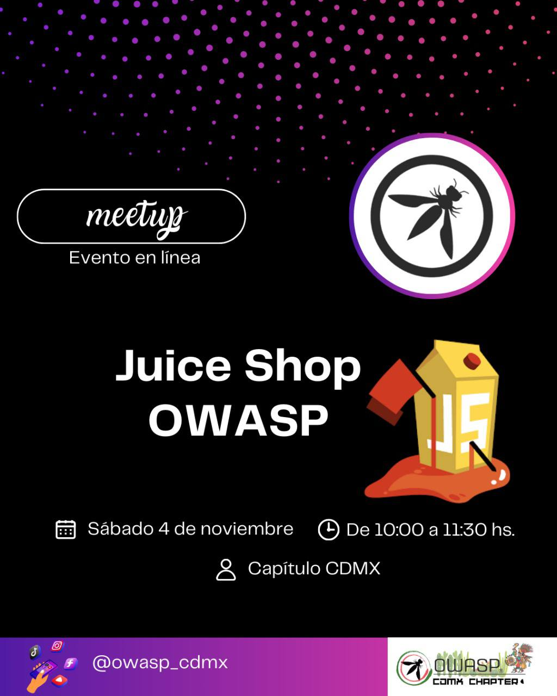
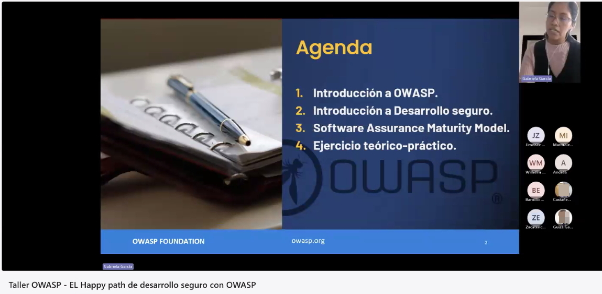
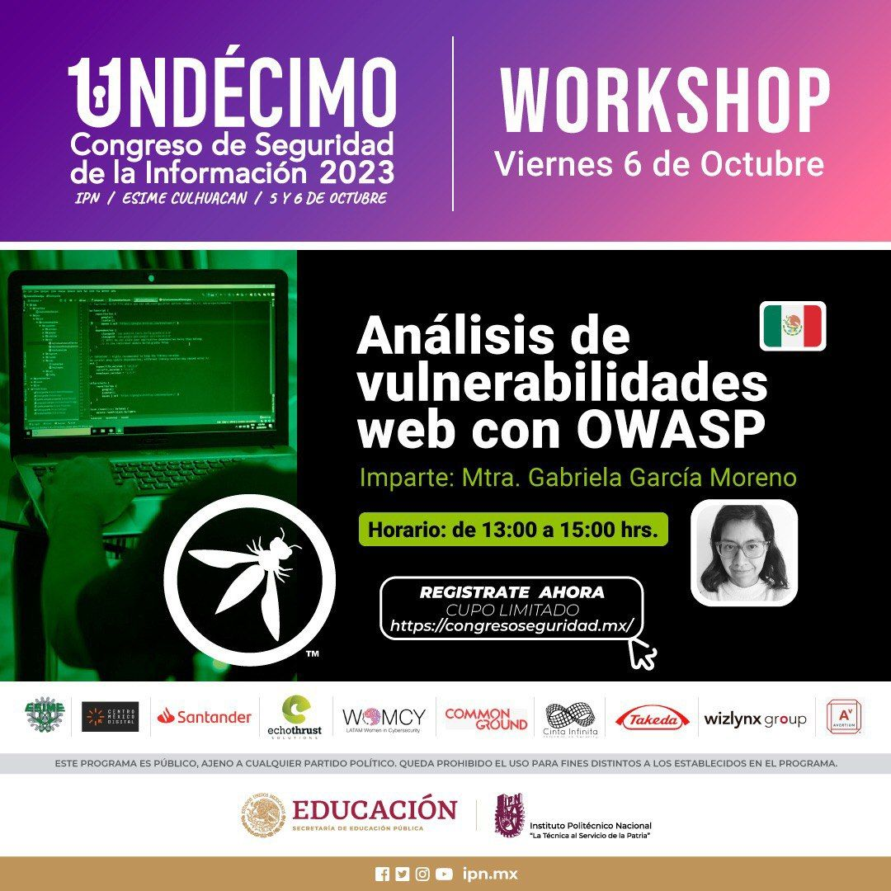

## Meetings del Capítulo

Sábado 4 de noviembre de 2023. Celebramos nuestro primer CHAPTER MEETING. <a href="assets/Chapter meeting -  JuiceShop -OWASP_CDMX.pdf">  Slides </a>.

## Workshops

30 de noviembre de 2023. Se impartió la conferencia "Cómo conocer la madurez de nuestras prácticas de desarrollo seguro con OWASP".

6 de octubre de 2023. Se impartió el workshop "Análisis de vulnerabilidades web con OWASP" en el Congreso de Seguridad de la Información del IPN. <a href="assets/AVOWASP-CSI23.pdf">  Slides del workshop</a>.
  

